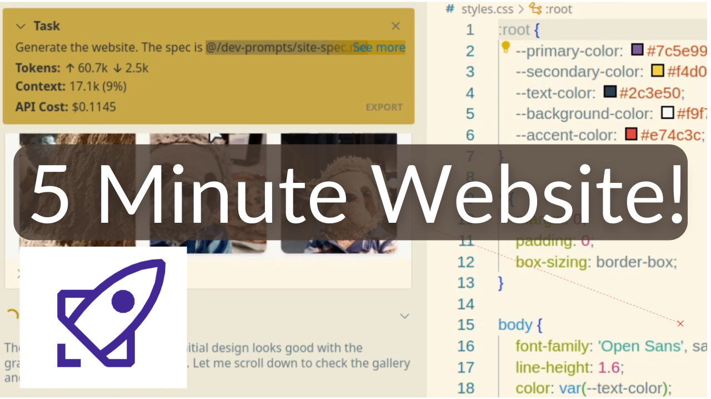

# Roo Code Landing Page Building Demo Project (YouTube)

[](https://github.com/cline-ai/cline) [](https://roo.ai)

[](https://www.youtube.com/watch?v=N3Lgg5Rgago)

This repository demonstrates how to effectively structure and organize AI prompts and editing instructions as repository files that can be referenced by AI tools like Roo Code and Cline. It was created as part of a tutorial video for [Daniel's Tech World YouTube channel](https://www.youtube.com/watch?v=N3Lgg5Rgago).

## Project Overview

The project showcases a demo website build using AI assistance, where the development instructions and specifications are stored as markdown files within the repository. This approach allows for better version control of AI prompts and makes it easier to maintain consistency across multiple AI interactions.

## Repository Structure

```
├── banner/             # Video thumbnail
│   └── banner.png     # Tutorial video banner
├── dev-prompts/       # Development prompts and specifications
│   ├── fixes1.md      # Specific fix instructions
│   └── site-spec.md   # Main site specifications
├── gallery/           # Image assets
│   ├── 1.png
│   ├── 2.png
│   ├── 3.png
│   └── 4.png
├── text/              # Content files
│   └── homepage.md    # Main page content
├── index.html         # Main HTML file
├── styles.css         # Stylesheet
└── netlify.toml       # Netlify configuration
```

## Key Features

- Structured AI prompts stored in version control
- Example of a complete website development workflow
- Integration with AI tools (Cline and Roo Code)
- Netlify deployment configuration
- Organized content and asset management

## Getting Started

1. Clone this repository
2. Review the prompts in the `dev-prompts` directory
3. Use these prompts with AI tools like Cline or Roo Code
4. Deploy to Netlify using the included configuration

## Tools Used

- [Cline](https://github.com/cline-ai/cline) - AI development assistant
- [Roo Code](https://roo.ai) - AI coding assistant
- Netlify for deployment

## Learn More

For more tutorials and tech content, visit [Daniel's Tech World](https://www.youtube.com/@danielstechworld) on YouTube.
